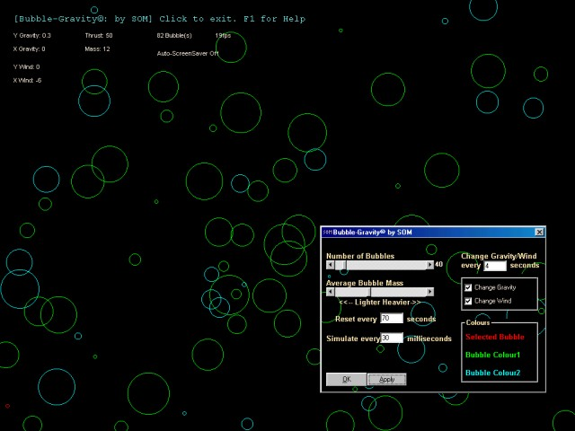



## Bubble\-Gravity

### Description

A screensaver and a simple simulation all in one. Little (or big) 'bubbles' bounce around the screen, following the laws of gravity and force. Each 'bubble' has a mass and velocity, and are affected by Gravity and Wind. You can change the gravity and wind, as well as changing the mass of an individual 'bubble' or applying a thrust to it. There are a lot of key commands, so press F1 while it's running if you're not sure what to do.

btw, if you look really carefully, it's not entirely accurate: but it's more than good enough for a screensaver, that's for sure :)
 
### More Info
 

             |
---                |---
**Submitted On**   |2002-05-01 19:44:22
**By**             |[Somma\!](https://github.com/Planet-Source-Code/PSCIndex/blob/master/ByAuthor/somma.md)
**Level**          |Beginner
**User Rating**    |4.8 (48 globes from 10 users)
**Compatibility**  |VB 5\.0, VB 6\.0
**Category**       |[Math/ Dates](https://github.com/Planet-Source-Code/PSCIndex/blob/master/ByCategory/math-dates__1-37.md)
**World**          |[Visual Basic](https://github.com/Planet-Source-Code/PSCIndex/blob/master/ByWorld/visual-basic.md)
**Archive File**   |[Bubble\-Gra77974512002\.zip](https://github.com/Planet-Source-Code/somma-bubble-gravity__1-34278/archive/master.zip)

